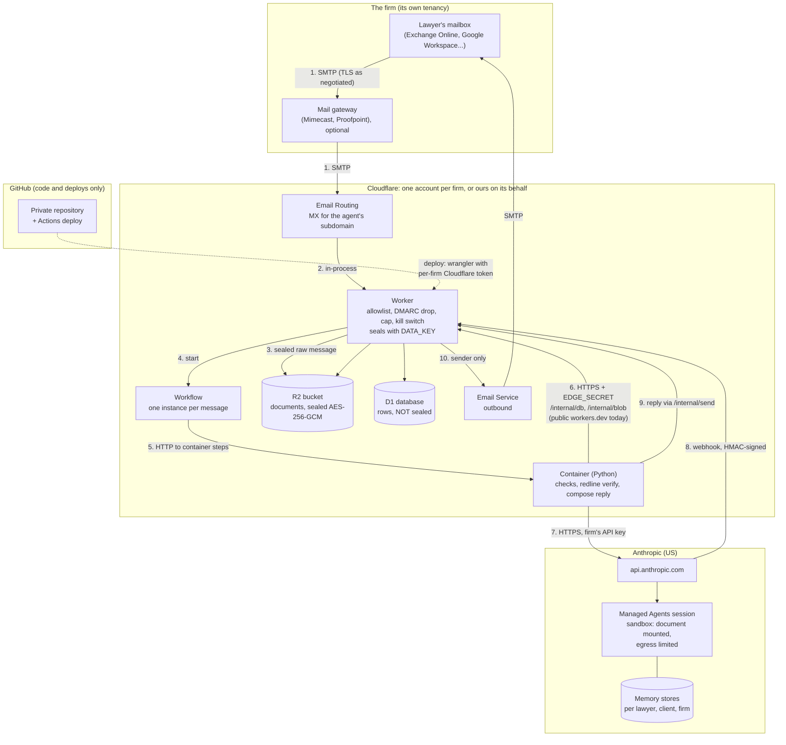

# Architecture and data flow

Every hop a firm's document takes, what is stored at each point, under whose
key, and where the trust boundaries are. Checked against the code on
2026-10-04; file names are given so a reviewer can read the code behind each
line.

## The diagram

Trust boundaries are the three subgraph edges the data crosses: the firm to
Cloudflare (SMTP), Cloudflare to Anthropic (HTTPS), and Anthropic back to
Cloudflare (the signed webhook, which carries no content). GitHub never
receives a firm's documents; it receives the deployment's configuration
(see "What sits in the repository").

## Every hop, in order

| # | From → to | Protocol and authentication | What crosses | Stored there | Encryption |
| --- | --- | --- | --- | --- | --- |
| 1 | Lawyer's mail server → Cloudflare Email Routing (MX of the agent's subdomain) | SMTP. TLS as negotiated by the sending server; forcing TLS is the firm's connector setting (`mail-flow.md`) | The whole message: body, attachments, headers | Nothing yet | In transit: TLS if negotiated. **Not verified**: what Cloudflare Email Routing does when the sender offers no TLS |
| 2 | Email Routing → Worker `email()` | In Cloudflare's runtime | The message | Nothing | n/a |
| 2a | Worker: admission | Drops a sender not on `ALLOWED_SENDERS` (exact address or exact domain; empty drops all), then a message whose `Authentication-Results` says `dmarc=fail` or `compauth=fail`, silently. Then the kill switch (held, below) and the daily cap (rejected) | — | A daily count in D1 (`edge_usage`) | — |
| 3 | Worker → R2 | Binding | The raw message, sealed with `DATA_KEY` (AES-256-GCM, a fresh 96-bit nonce per object; `cloudflare/src/seal.ts`, `src/lra/crypto.py`) | `inbound/<uuid>.eml` until reviewed; 7-day R2 lifecycle rule as a backstop. While paused: `held/<uuid>.eml` | Firm's key, and Cloudflare's at-rest encryption |
| 4 | Worker → Workflow | Binding | A pointer (R2 key, time received); the instance id is a SHA-256 of Message-ID and sender | Workflow instance state | Cloudflare's |
| 5 | Workflow → Container | Durable Object container binding, Cloudflare-internal | Step requests: `/prepare`, `/session/start`, `/session/status`, `/finish`, `/finished` | Each step's result is kept with the instance: the filename, session id, the short "Reviewing X; back in about N minutes" notice (subject and filename in plaintext), and a pointer to the sealed reply | Cloudflare's; the reply itself is sealed in R2 (`job/`) |
| 6 | Container → Worker `/internal/db`, `/internal/blob/*`, `/internal/send`, `/internal/release` | **HTTPS over the public internet** to `https://<worker>.<account>.workers.dev`, `Authorization: Bearer EDGE_SECRET` (compared in constant time) | SQL statements and results; sealed blobs | D1 rows; R2 objects | TLS in transit. Blobs sealed before they leave the container. Rows not |
| 7 | Container → Anthropic | HTTPS to `api.anthropic.com`, the firm's API key (a Worker secret) | The document (uploaded, mounted read-only in the session's sandbox, upload deleted as soon as the session has it), the instructions from the email, the deterministic checks' findings, the memory stores for this lawyer, client and firm | A session (transcript), its output files, memory stores. See "Retention at Anthropic" | TLS in transit; Anthropic's at rest |
| 7a | Inside the sandbox | Anthropic's container, networking `limited`: no allowed hosts, package managers allowed, MCP servers only if a document system is configured (`managed.NETWORKING`) | Our skill's scripts and Anthropic's document skills run on the mounted file | Session container | — |
| 8 | Anthropic → Worker `/anthropic/webhook` | HTTPS POST, Standard Webhooks HMAC-SHA256 with the `whsec_` key, five-minute tolerance (`cloudflare/src/webhook.ts`); unsigned gets 401; no key configured gets 404 | Event type and session id only | Event id in D1 for de-duplication, 31 days | — |
| 9 | Container → Anthropic, finishing | HTTPS | Reads the findings and the output file; deletes the files it uploaded and the files the session wrote; then **deletes** the session (`src/lra/managed.py`) | Nothing of ours; a failed delete is retried by the daily sweep. Anthropic's own backend retention: up to 30 days (`docs/trust.md`) | — |
| 10 | Container → Worker `/internal/send` → Email Service → lawyer | As hop 6, then Cloudflare's Email Service | The reply and its files | Outbox row in D1 (key, state, message id: no content), 31 days | **Not verified**: whether Cloudflare's Email Service requires TLS to the recipient's MX |
| — | Daily cron (Worker `scheduled()`) | — | — | Deletes `inbound/` and `job/` objects, outbox rows and webhook ids older than 31 days; wakes Workflows a lost webhook left waiting; calls the container's retention sweep (`POST /retention/sweep`, `src/lra/retention.py`); releases held mail when not paused | — |
| — | Retention sweep (daily, `src/lra/retention.py`) | — | — | Job rows after `RETENTION_HOURS` (24); conversations with their R2 objects, versions and negotiation record, closings, and unconfirmed notes after `THREAD_RETENTION_DAYS` (7) since last activity; archived mail after `ARCHIVE_RETENTION_DAYS` (7) when the archive is on; any Anthropic session or upload whose delete failed. It runs while paused too | — |

Optional, off unless the firm connects a document system (`DMS_PROVIDER`):
per-lawyer, read-only OAuth to iManage through a second Worker
(`cloudflare/dms-mcp`), tokens sealed under `DATA_KEY`. Never run against a
real iManage; see `docs/oauth.md`.

## What is stored, and under which key

| Store | Contents | Firm's `DATA_KEY` | Deleted by |
| --- | --- | --- | --- |
| R2 `inbound/`, `held/`, `job/` | Raw messages, held mail, a review's reply between steps | Yes | Review end; lifecycle 7 days; cron 31 days; release |
| R2 `thread/`, `doc/` | Each conversation's documents, earlier versions | Yes | `THREAD_RETENTION_DAYS`; `lra purge` |
| R2 `archive/` | Archived attachments, **only if `ARCHIVE_ENABLED`** (off) | Yes | `ARCHIVE_RETENTION_DAYS`; `lra purge` |
| D1 | Job rows, conversations (filenames, findings, the text of each tracked change, the undo ledger), memory notes (unconfirmed ones 7 days; confirmed ones until removed; no record of kept or undone changes while `LEARN_FROM_OUTCOMES` is off), the client register, the no-AI list, the audit trail, purge records, outbox, webhook ids, OAuth tokens (sealed) | **No**, except OAuth tokens | Retention settings; `lra purge`; the audit trail is kept and blanked |
| D1 archive index | Extracted text of archived mail, plaintext, for search, **only if `ARCHIVE_ENABLED`** | No | As the archive |
| Cloudflare Workflows | Step results (above) | No | With the instance |
| Cloudflare logs (Workers Observability is on) | Operational lines: "dropped mail from a sender not on the allowlist", step names, errors. We have not audited every log line of the Python container for content | No | Cloudflare's log retention |
| Anthropic sessions | Transcript: instructions, what the agent read and wrote, tool results | No (CMEK not configured) | Deleted when the review ends; the daily sweep retries a failed delete; `lra purge` makes sure |
| Anthropic files | Uploaded document, outputs | No | Deleted at session start (uploads) and at session end (outputs); `lra purge` makes sure |
| Anthropic memory stores | What a lawyer asked it to remember: one per lawyer (style only), per matter, per client, one per firm | No | The lawyer, or `lra purge`; not by retention |

What the key is: 32 random bytes, base64, generated by `lra keygen` or by
`lra tenant provision --apply`, put on the Worker as a secret, and written to
`deployments/<firm>/.env` (mode 600) on the machine that provisioned it. It
is not in a KMS or HSM. Withdrawing it (deleting the Worker secret and every
copy) makes everything sealed unreadable. `DATA_KEY_PREVIOUS` lets a new key
read what the old one sealed; there is no command yet that re-seals stored
data under the new key.

## Retention at Anthropic

Deleted when the review ends; see `docs/trust.md`.

- The files we upload are deleted as soon as the session has them, the files
  a session writes when it ends, and the session itself, with its
  turn-by-turn record, when the review ends (`src/lra/managed.py`). A delete
  that failed is retried by the daily sweep once the job is 7 days old
  (`src/lra/retention.py`); the audit row keeps the ids and says when they
  went.
- Anthropic's own retention sits under that: Managed Agents "session
  transcripts persist until you delete them", and Managed Agents is not
  eligible for zero data retention, "including self-hosted sandboxes"
  ([API and data retention](https://platform.claude.com/docs/en/manage-claude/api-and-data-retention),
  read 2026-10-04). Its documentation does not say whether anything of a
  deleted session stays on its backend within its 30-day retention of inputs
  and outputs, so up to 30 days is what can be promised (`docs/trust.md`).
- Anthropic may keep flagged inputs and outputs longer: "if a chat or
  session is flagged, Anthropic may retain inputs and outputs for up to 2
  years" (same page).
- Memory stores hold only what a lawyer asked it to remember, and stay until
  the lawyer or a purge removes them.

`ZERO_RETENTION=true` moves every model call and agent to Claude Opus 5,
which is available under ZDR; it does not make Managed Agents sessions ZDR.
A client that must have nothing retained anywhere goes on `NO_AI_MATTERS`.

## Where it runs

- **Cloudflare:** D1 and R2 are created in the EU when the tenant is made
  with `--jurisdiction eu` (`src/lra/tenant.py`). Otherwise Cloudflare's
  default placement. The Worker runs at Cloudflare's edge. Where the
  container runs is **not verified**: placement constraints may not apply to
  Durable-Object-managed containers
  ([workers-sdk #15995](https://github.com/cloudflare/workers-sdk/issues/15995)).
- **Anthropic:** workspace geography is `us` only; inference geography is
  `us` or `global` ([Data residency](https://platform.claude.com/docs/en/manage-claude/data-residency),
  read 2026-10-04). `INFERENCE_GEO=us` pins the agents to US inference (at
  1.1x price); unset follows the workspace default. There is no EU or UK
  option on Anthropic's first-party API.

## Per-firm isolation

One firm, one deployment (DECISIONS 27; `docs/deploy-cloudflare.md`, "One
deployment per firm"): its own Worker, container, D1 database, R2 bucket,
Workflow, agent address, allowlist, `DATA_KEY`, `EDGE_SECRET`, Anthropic API
key, agents, environment and firm memory store. Nothing is shared but the
code. `lra tenant check` (run by the test suite) fails if two tenants share a
Worker, database, bucket, Workflow, address, agent or memory store, and
`lra selftest --tenant` reports the same. A firm's resources can live in the
firm's own Cloudflare account (`--account-id`) and its agents in the firm's
own Anthropic organisation (its key in `deployments/<firm>/.env`).

Inside one firm, memory is walled by client (`docs/memory.md`): a client's
notes are read only on that client's matters, a lawyer's personal notes may
hold no party, client, sum or proper name, and a client the system cannot
identify gets no cross-matter memory. Per-matter ethical screens between
lawyers of the same firm are **not built**.

## Inbound surfaces on the internet

| Path | Who can reach it | What protects it |
| --- | --- | --- |
| SMTP to the agent's address | Anyone | The allowlist and DMARC drop, before anything costs money |
| `GET /health` | Anyone | Returns `{"edge":"ok"}`, nothing else |
| `POST /anthropic/webhook` | Anyone | HMAC signature; 404 when no key is set |
| `/oauth/callback` | Anyone | 404 unless a document system is configured |
| `/internal/db`, `/internal/blob/*`, `/internal/send`, `/internal/release` | **Anyone who can reach `workers.dev`** | One bearer secret, `EDGE_SECRET`. See below |

## Known exposures, and what is being done

- **`/internal/*` on the public hostname.** `/internal/db` runs any SQL
  statement sent to it, so a leaked `EDGE_SECRET` is read and write access to
  every row in D1 (findings, filenames, change text in plaintext) and the
  ability to send mail as the agent. Documents in R2 stay sealed without
  `DATA_KEY`. **In progress** (another change, not in `main` on 2026-10-04):
  the container reaches the Worker through Cloudflare Containers' outbound
  handlers, so `/internal/*` is no longer served to the internet. `lra
  selftest` reports this as a WARN while the endpoints answer 401, and PASS
  once they answer 404.
- **Container egress is open** (`enableInternet = true` in
  `cloudflare/src/index.ts`). The same outbound-handler work is the route to
  an egress allowlist (`api.anthropic.com` and the Worker). Not built.
- **DMARC.** The Worker drops only an explicit `dmarc=fail` (or
  `compauth=fail`). A domain with no DMARC record, or a `none` result, passes
  to the allowlist check. **In progress** (same change): require a DMARC pass
  for allowlisted domains. Until then, a firm whose own domains publish
  DMARC at `p=reject` is protected by its own policy; a subsidiary domain
  without DMARC is not.
- **D1 rows are not sealed.** Decided not yet (DECISIONS 28; "Not yet, on
  purpose" in `STATUS.md`), to be done when a firm asks.

## What sits in the repository

The deployment is configuration in a private GitHub repository:
`deployments/<firm>/tenant.jsonc` holds the firm's vars, which include
`ALLOWED_SENDERS` (lawyers' addresses or domains), `PLAYBOOK_ADMINS`, and
`NO_AI_MATTERS` (client names or matter numbers on the no-AI list).
Secrets (`DATA_KEY`, `EDGE_SECRET`, the Anthropic key) are never in the
repository; per-firm Cloudflare API tokens are GitHub Actions secrets
(`CLOUDFLARE_API_TOKEN_<FIRM>`). A push to `main` that passes CI deploys
every firm, the founder's own deployment first as a canary
(`.github/workflows/deploy.yml`). A firm that does not want client names in
GitHub should keep `NO_AI_MATTERS` to matter numbers or domains, or add
entries by admin email (stored in D1, not the repository).

## The same, as a plain list

1. Lawyer sends or BCCs to `review@legal.<firm>.com` over SMTP.
2. Cloudflare Email Routing hands it to the firm's Worker.
3. The Worker drops strangers and DMARC failures silently; holds it if paused;
   refuses it past the daily cap.
4. The Worker seals it with the firm's key into R2 and starts a Workflow.
5. The Workflow calls the container's steps; each step's small result is kept
   by Workflows.
6. The container reads and writes rows in D1 and sealed objects in R2 through
   the Worker's `/internal/*` endpoints, over HTTPS with a bearer secret.
7. The container runs the deterministic checks locally.
8. Unless the client is on the no-AI list, the container uploads the document
   to Anthropic and opens a Managed Agents session (US, limited egress), then
   deletes the upload.
9. Anthropic's signed webhook wakes the Workflow; it also polls.
10. The container reads the findings and the file, verifies the file, and
    deletes the session's files and the session.
11. The reply is sealed in R2, then sent through Cloudflare's Email Service to
    the sender only, with the privilege legend.
12. Retention removes the raw message once answered, job rows after 24 hours,
    the conversation after 7 days idle (a daily sweep); `lra purge` removes a client's, matter's
    or lawyer's everything, at Anthropic too; the audit row stays, blanked.
